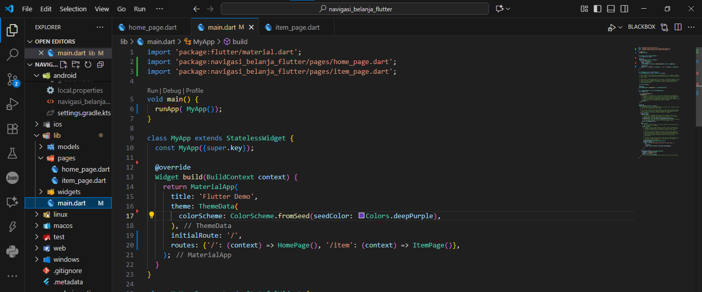
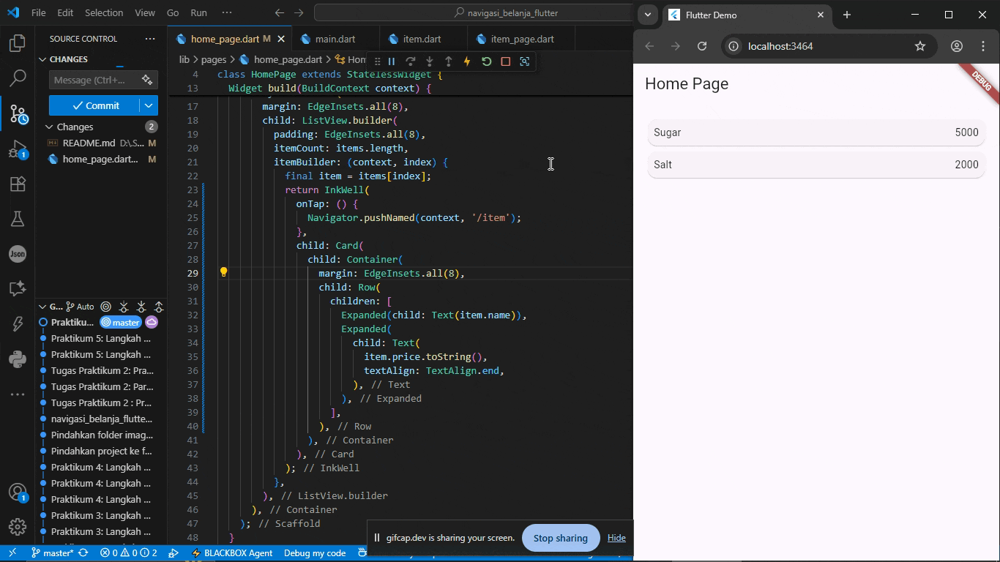

A new Flutter project.

## Getting Started

# Jobsheet 6 : Layout dan Navigasi

## Praktikum 1: Membangun Layout di Flutter

### Langkah 1: Buat Project Baru
Buatlah sebuah project flutter baru dengan nama layout_flutter. Atau sesuaikan style laporan praktikum yang Anda buat.

---

### Langkah 2: Buka file lib/main.dart
Buka file main.dart lalu ganti dengan kode berikut. Isi nama dan NIM Anda di text title.

---

### Langkah 3: Identifikasi layout diagram

--

### Langkah 4: Implementasi title row

---

## Praktikum 2: Implementasi button row

### Langkah 1: Buat method Column _buildButtonColumn

---

### Langkah 2: Buat widget buttonSection

---

### Langkah 3: Tambah button section ke body

---

## Praktikum 3: Implementasi text section

### Langkah 1: Buat widget textSection

---

### Langkah 2: Tambahkan variabel text section ke body

---

## Praktikum 4: Implementasi image section

### Langkah 1: Siapkan aset gambar

---

### Langkah 2: Tambahkan gambar ke body

---

### Langkah 3: Terakhir, ubah menjadi ListView

---

## Praktikum 5: Membangun Navigasi di Flutter

### Langkah 1: Siapkan project baru

---

### Langkah 2: Mendefinisikan Route

---

### Langkah 3: Lengkapi Kode di main.dart

---

### Langkah 4: Membuat data model

---

### Langkah 5: Lengkapi kode di class HomePage

---

### Langkah 6: Membuat ListView dan itemBuilder

---

### Langkah 7: Menambahkan aksi pada ListView

---

# Tugas Praktikum 2

## 1. Menambahkan informasi arguments pada penggunaan Navigator
